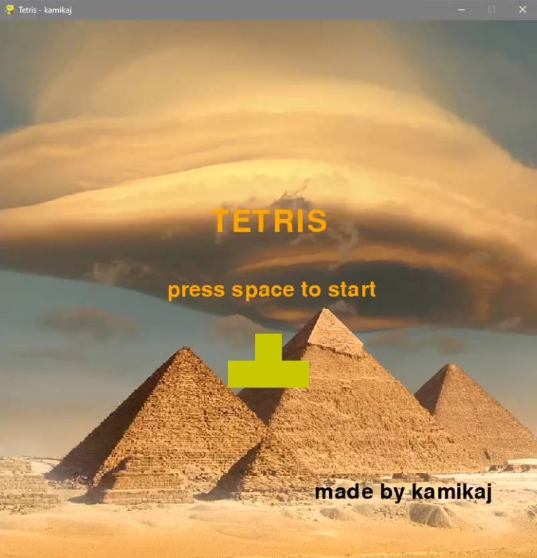
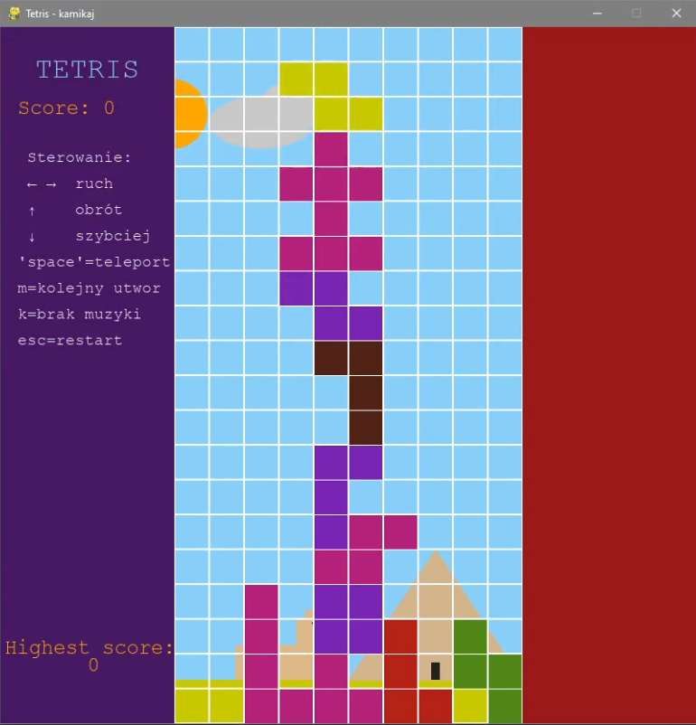

# 🧱 Retro Tetris — Modular Architecture & Dynamic Environment Engine

An advanced, modular clone of the classic **Tetris** game built with Python and the **Pygame** framework. This project focuses on clean software architecture, distinct separation of concerns, custom audio event loops, and dynamic, procedurally adjusted visual rendering.

The core game loop and piece rendering mechanics were inspired by [this baseline implementation](https://gist.github.com/timurbakibayev/1f683d34487362b0f36280989c80960c), then heavily expanded with an adaptive graphics pipeline, persistent high-score serialization, and an active multi-state scene controller.

---

## 🚀 Key Engineering & Architecture Highlights

* **🧱 Strict Modular Design:** The codebase is decoupled into single-responsibility modules: `main.py` handles the bootstrap, `tetris.py` manages physics/state, `figure.py` operates matrix transformations, and `drawing.py` drives the rendering engine.
* **☀️ Dynamic Day/Night Cycle:** Implements a real-time environmental update loop (`update_positions`). Objects like the procedurally drawn Sphinx and Pyramids adaptively modify their color shading vectors and shadow densities based on solar/lunar coordinate interpolations.
* **🔄 Coordinate-Matrix Tetrominos:** Tetromino types and rotations are stored as structured spatial arrays. Collision handling utilizes an intersection matrix algorithm (`intersects()`) to seamlessly block clipping out-of-bounds or into existing geometry.
* **🎵 Event-Driven Audio Subsystem:** Leverages Pygame's mixer subsystem bound to custom triggers (`pg.USEREVENT + 1`) to detect track completion, creating an automated background playlist queue alongside context-specific audio states (Intro vs. Game Over).
* **💾 Local Storage Persistence:** Integrates a native `json` data layer managing decoupled read/write operations to maintain cross-session persistent state tracking for the player's personal best.

---

## 🕹️ Input Controls Matrix

The user interface uses a dual-panel layout (Info Panel on the left, Matrix Grid in the center) fully mapped to the following keyboard bindings:

| Key / Action | Game Mode Function | System / Audio Utility |
| :--- | :--- | :--- |
| **`LEFT` / `RIGHT` Arrows** | Shift active Tetromino horizontally | — |
| **`UP` Arrow** | Rotate Tetromino 90° clockwise | — |
| **`DOWN` Arrow** | Soft Drop (Accelerate downward velocity) | — |
| **`SPACEBAR`** | Hard Drop (Instant vertical teleport & lock) | Start Game (From Intro Screen) |
| **`I`** | Toggle Pause Overlay | Resume Active Game State |
| **`M`** | — | Cycle to the next soundtrack |
| **`K`** | — | Mute / Kill audio mixer output |
| **`ESCAPE`** | Soft reset engine to Main Menu | Restart Session (From Game Over) |

---

## 📸 Screenshots





---

## 📂 Project Structure

```text
Tetris/
│
├── main.py            # Main game loop, event polling, and state coordinator
├── tetris.py          # Core game logic, line-clearing mechanics, and freeze states
├── figure.py          # Tetromino configuration shapes and rotation matrix bounds
├── drawing.py         # Dynamic environment subsystem (Day/Night, Sphinx, Pyramids, UI)
├── music_player.py    # Class wrapper handling soundtrack sequencing via custom events
├── settings.py        # Global configurations, dimensions, and theme color constants
└── resources/
    ├── highscore.json # Persistent JSON data layer tracking local high scores
    ├── background/    # Directory holding static pixel/background graphical assets
    └── music/         # Audio asset directory split into theme, effects, and soundtracks
